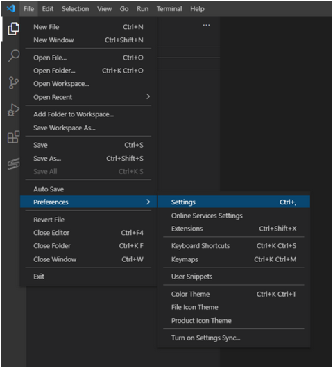
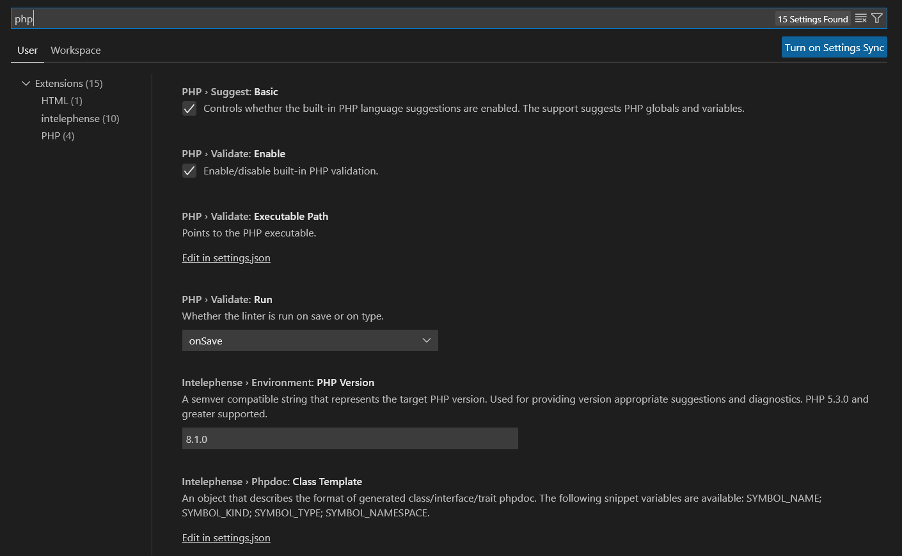
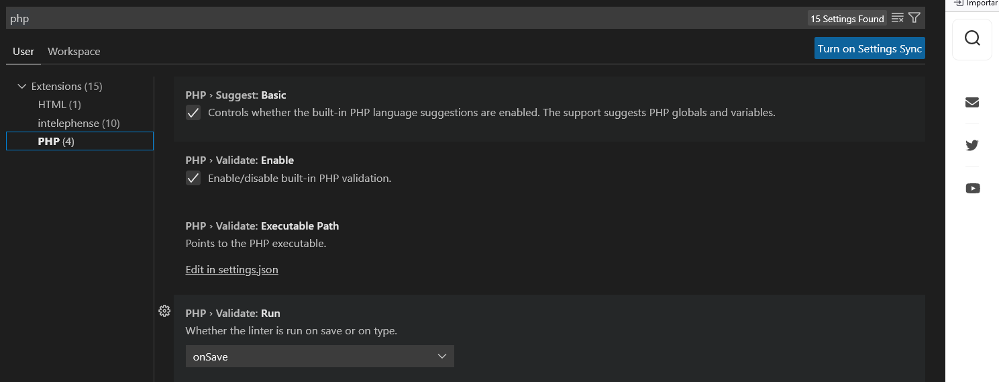
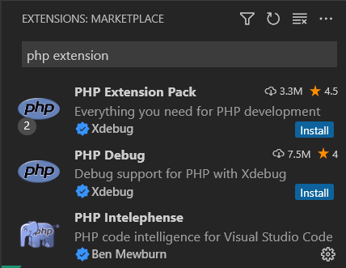
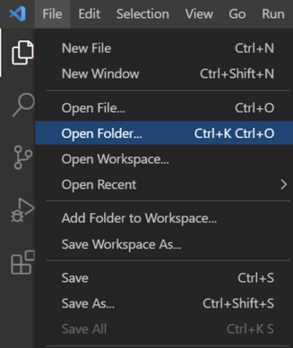
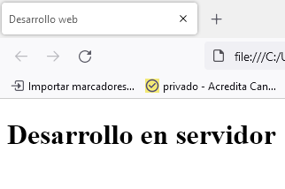
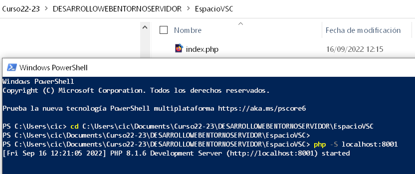
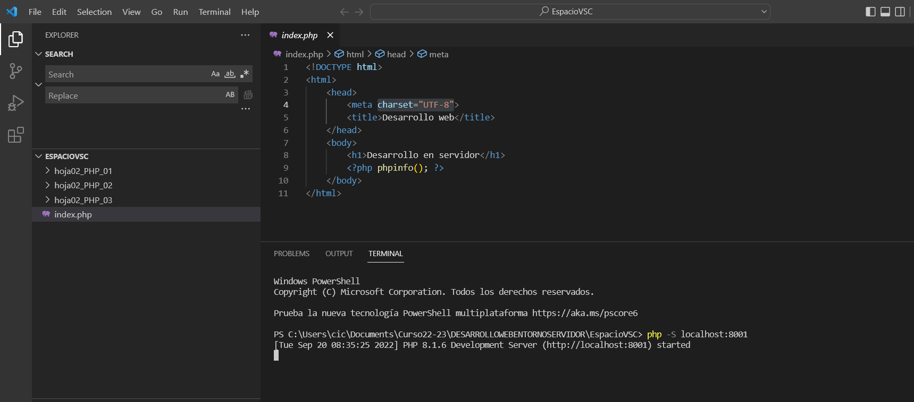

# Configurar Visual Studio Code para PHP

## Índice

  - [Configuración](#configuración)
  - [Extensiones PHP en Visual Studio Code](#extensiones-php-en-visual-studio-code)
  - [Mi primer Programa en PHP con Visual Studio Code](#mi-primer-programa-en-php-con-visual-studio-code)
  - [Utilizar un servidor local de PHP](#utilizar-un-servidor-local-de-php)

## Configuración

Visual Studio Code utiliza el propio motor de PHP para interpretar la sintaxis del lenguaje de programación. 
Para permitir que nuestro Visual Studio Code nos proporcione toda la potencia de PHP, __lo primero que tenemos que hacer es modificar los Ajustes para decirle a VS Code dónde está instalado PHP__.

Para ello, una vez abierto Visual Studio Code, vamos a __Archivo -> Preferencias -> Ajustes (File -> Preferences -> Settings)__, o utilizamos el atajo de teclado __«Control+,»__. Esto nos abrirá el panel de Ajustes que debemos modificar a continuación.



Escribimos «php» en la barra superior para filtrar los ajutes y sólo mostrar los que necesitamos:



En este panel de ajustes, debemos asegurarnos que las opciones de «Enable» y «Run» estén marcadas. Tras esto, __vamos a modificar el fichero settings.json__ para incluir la ruta al ejecutable de PHP que tenemos instalado en nuestro ordenador.



Nota: Si no tienes PHP instalado, necesitarás instalarlo previamente.
```json
{
    "php.validate.executablePath": "c:\\xampp\\php\\php.exe",
    "explorer.confirmDelete": false,
    "explorer.confirmDragAndDrop": false
}
```
La ruta dependerá del Sistema Operativo que estés usando (Windows, Linux o Mac).

## Extensiones PHP en Visual Studio Code

__PHP Extension Pack__: contiene PHP Debug y PHP Intelephense



Para comprender bien cómo funciona la depuración en VS Code os recomendamos [guía de debug](https://code.visualstudio.com/docs/editor/debugging)

## Mi primer Programa en PHP con Visual Studio Code
Lo primero que tenemos que hacer, como siempre que utilizamos VS Code, es abrir __una Carpeta o Espacio de trabajo (Workspace)__ para comenzar a trabajar.



en mi caso, creo una __nueva carpeta EspacioVSC (de momento vacía)__ y la selecciono. A continuación, creamos un nuevo fichero llamado __index.php__ y que será el punto de entrada de nuestra web en PHP.
```html
<!DOCTYPE html>
<html>
    <head>
        <meta charset="UTF-8">
        <title>Desarrollo web</title>
    </head>
    <body>
        <h1>Desarrollo en servidor</h1>
    </body>
</html>
```
Para verlo en el navegador, podemos hacer botón derecho sobre el fichero index.php y abrirlo con Firefox. De momento esto nos servirá, ya que aún no hemos añadido código PHP



__Finalmente, vamos a probar a introducir código PHP en nuestra web__, para comprobar que toda la configuración de Visual Studio Code es correcta. Por ejemplo, podemos probar a mostrar en nuestra página web información sobre la instalación de PHP (versión, etc).
```php
<?php>
    phpinfo();
?>
```
el código PHP se introduce entre las etiquetas __<?php y ?>__, ya que es la sintaxis típica de PHP. Mientras escribimos dentro de estas etiquetas, tenemos ayuda por parte de la extensión de IntelliSense que hemos activado previamente, de forma que no tenemos que aprendernos de memoria todas las funciones disponibles en PHP.

## Utilizar un servidor local de PHP
Tras introducir código PHP en el fichero index, te habrás dado cuenta de que no se visualiza en nuestro navegador. Esto es porque __el código PHP necesita un servidor para poder ser ejecutado__, así que ya no vale símplemente con abrir el fichero index.php con nuestro navegador.
Un workaround rápido es abrir con un __Explorador de Archivos__ la carpeta donde está nuestro index.php, y levantar una __Terminal/Consola/Powershell__. A continuación escribimos el comando:

```powershell
php -S localhost:8001
```


Y en ese momento ya tendremos __un servidor local__ que es capaz de __ejecutar nuestra web PHP__ en la dirección http://localhost:8001 (en vez de 8001, puedes elegir el puerto que quieras que no esté ocupado).


También podemos realizar la acción de utilizar un servidor local de PHP desde el propio visual studio code abriendo una terminal

