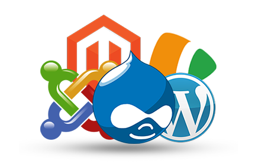

# UT5 - GESTORES DE CONTENIDO

## Índice
- [UT5 - GESTORES DE CONTENIDO](#ut5---gestores-de-contenido)
  - [Índice](#índice)
  - [¿Qué es un gestor de contenido?](#qué-es-un-gestor-de-contenido)
  - [¿Cómo funciona un gestor de contenidos?](#cómo-funciona-un-gestor-de-contenidos)
  - [Estructura de un CMS](#estructura-de-un-cms)
  - [Tipos de gestores de contenido](#tipos-de-gestores-de-contenido)
  - [¿Qué necesitaremos para instalar un CMS?](#qué-necesitaremos-para-instalar-un-cms)

## ¿Qué es un gestor de contenido?
Los Sistemas Gestores de Contenidos o CMS (Content Management System) son programas que permiten crear y administrar contenidos de forma sencilla. 

El CMS es un programa instalado en un servidor web que permite crear una Web sin necesidad de conocer el lenguaje HTML para poder publicar fotos, artículos, archivos, etc. El acceso al CMS, tanto para administrarlo como para ver los contenidos, se realiza utilizando un navegador web.

La interfaz que utiliza el CMS está basada en formularios, donde se dan de alta los contenidos de forma organizada, de manera que puedan aparecer en la parte de la web donde los hemos dado de alta. Luego, el CMS tendrá dos partes diferenciadas:

* __Backend__ – donde los usuarios autorizados administran el CMS, cargan contenidos, etc.
* __FrontEnd__ – Lugar donde se visitan y ven los contenidos cargados desde el Backend.
Los Gestores de Contenidos suelen ir destinados a:
  * Empresas que necesitan proveer de información actualizada a sus clientes (catálogos, artículos, etc).
  * Corporaciones que informan de noticias, productos, comunicados, etc.
  * Páginas personales, redes sociales como Blogger, WordPress, etc.

## ¿Cómo funciona un gestor de contenidos?

El Gestor de Contenidos trabaja en el servidor web que lo aloja. Para acceder al Gestor utilizamos el navegador y adicionalmente podemos usar un servicio FTP para subir los archivos con más facilidad.

Los usuarios acceden al gestor tecleando la URL en el navegador, entonces el servidor selecciona el esquema gráfico e introduce los valores de la base de datos que correspondan. La página se genera dinámicamente para el usuario, el código HTML se genera con esa llamada y, normalmente, el gestor tiene varios formatos o plantillas de presentación para dotar de más flexibilidad al acceso a los contenidos.

## Estructura de un CMS

Las funciones de un CMS están separadas en:

* __Front-End__: Sitio Web donde los visitantes y usuarios registrados ven la información.
* __Back-End__: Contiene la parte de administración del gestor, suele estar localizado en otra URL y en esta parte se realizan las tareas de configuración, mantenimiento, limpieza, creación de estadísticas, administración de usuarios, etc.
* __Configuración__: Normalmente tienen un apartado de “Configuration Settings” para tomar las decisiones relativas al título del sitio web, palabras para los motores de búsqueda, opciones para permitir/prohibir alta a los usuarios, etc.
* __Derechos de acceso__: Son los privilegios de acceso que se dan a los distintos usuarios que pueden acceder al Gestor, pueden ser desde administradores a editores de contenido o autores.
* __Contenido__: Los contenidos pueden ser muy variados: textos, imágenes, videos, música, archivos multimedia… o combinaciones de ellos. Para facilitar la presentación y gestión de los contenidos, se dispone de estructuras que permiten jerarquizar la información en categorías, secciones.
* __Plantillas__: Para personalizar la forma (colores, tipos de letra, etc), en que se presenta la información.
* __Extensiones__: Normalmente los gestores son ampliables y las distintas funcionalidades del gestor se denominan componentes, por ejemplo, una tienda on-line, el gestor de usuarios, gestor de correo, foro, galería de imágenes, gestor de descarga, etc. Los módulos que se necesitan integran con loa componentes son utilizados para insertar contenidos en la parte deseada dentro de la plantilla. También son consideradas extensiones los plug-in, los paquetes de idioma o las plantillas.

## Tipos de gestores de contenido

Esta clasificación de los gestores de contenido es en base a la funcionalidad principal que aportan: 

* __Gestión de Portales__: Son CMS que gestiona el contenido de un sitio web. Por ejemplo: Joomla, Drupal.
* __Blogs__: Permiten publicar noticias ordenadas cronológicamente y permitiendo comentarlas. Ejemplos: Blogger y WordPress.
* __Wikis__: Permiten la creación colaborativa de contenidos. Ejemplo: Wikipedia.
* __Gestores de Comercio Electrónico__: Permiten generar sitios web destinados al comercio electrónico. Ejemplo: Magento.
* __Galerías__: Sitio web con contenido audiovisual. Ejemplo: Gallery.
* __Gestores e-learning__: Son una variedad conocida como LMS (Learning Management System), están destinados a procesos de aprendizaje. Ejemplo: Moodle.

## ¿Qué necesitaremos para instalar un CMS?
Los gestores de contenidos, al ser aplicaciones web, precisan de un Servidor de Aplicaciones Web. Podemos decidirnos por un servidor web como IIS o Apache, un SGBD (SQL Server, Oracle, MySQL, etc) y un lenguaje de programación (C#, Perl, PHP, Java…).

No obstante, cuando las tecnologías empleadas son de código abierto, lo habitual es que el sistema operativo del servidor sea GNU/Linux, en cualquiera de sus distribuciones, sobre el que se ejecuta un servidor Apache, con soporte para PHP y como SGBD se utilice MySQL.
