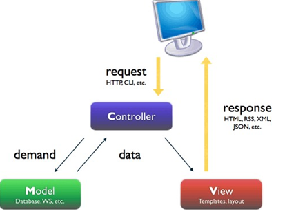
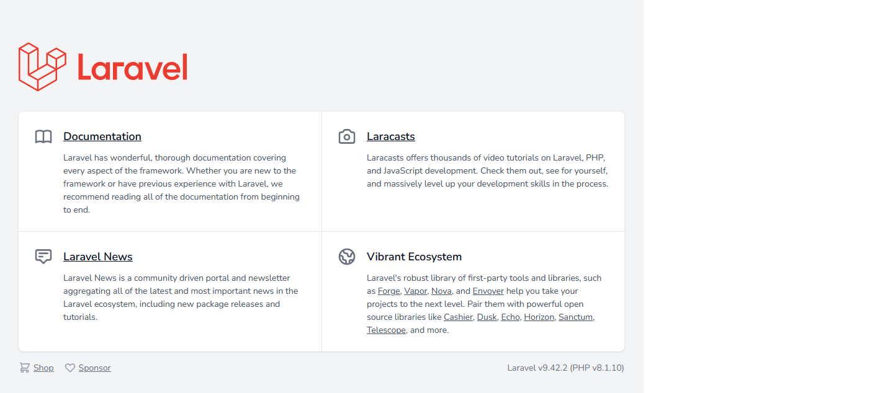

# UT6 GENERACIÓN DINÁMICA DE PÁGINAS WEB 

## Índice

## Patrón arquitectónico MVC (Modelo-Vista-Controlador)

En muchas ocasiones se mezcla el código propio de la lógica de la aplicación, con el código necesario para crear el interface web que se presenta a los usuarios.

Existen varios métodos que permiten separar la lógica de presentación (en nuestro caso, la que
genera las etiquetas HTML) de la lógica de negocio, donde se implementa la lógica propia de
cada aplicación.

El más extendido es el patrón de diseño Modelo – Vista – Controlador (MVC). Este patrón pretende dividir el código en tres partes, dedicando cada una, a una función definida y diferenciada de las otras:

* __Modelo__: es el encargado de manejar los datos propios de la aplicación.Debe proveer mecanismos para obtener y modificar la información del mismo. Si la aplicación utiliza algún tipo de almacenamiento para su información (como un SGBD), tendrá que encargarse de almacenarla y recuperarla.

* __Vista__: es la parte del modelo que se encarga de la interacción con el usuario. En esta parte se encuentra el código necesario para generar el interface de usuario (en nuestro caso en HTML), según la información obtenida del modelo.

* __Controlador__: en este módulo se decide qué se ha de hacer, en función de las acciones del usuario con su interface. Con esta información,interactúa con el modelo para indicarle las acciones a realizar y, según el resultado obtenido, envía a la vista las instrucciones necesarias para generar el nuevo interface.

### Funcionamiento MVC

1 El usuario envía petición al controlador vía una URL
2 El controlador solicita al modelo los datos
3 El modelo devuelve los datos
4 El controlador selecciona una vista
5 Se devuelve la vista seleccionada al controlador
6 El controlador devuelve una vista (página php) que carga los datos del modelo seleccionado

Aunque se puede programar utilizando MVC por tu cuenta, es más habitual utilizar el patrón MVC en  conjunción con un framework o marco de desarrollo. Existen numerosos frameworks disponibles en PHP,  muchos de los cuales incluyen soporte para MVC.

__La arquitectura MVC__ separa __la lógica de negocio__ (el modelo) y __la  presentación__ (la vista) por lo que se consigue un mantenimiento  más sencillo de las aplicaciones.

Si por ejemplo una misma aplicación debe ejecutarse tanto en un  navegador estándar como un navegador de un dispositivo móvil,  solamente es necesario crear una vista nueva para cada  dispositivo; manteniendo el controlador y el modelo original. 

__El  controlador se encarga de aislar al modelo y a la vista de los  detalles del protocolo__ utilizado para las peticiones (HTTP, consola  de comandos, email, etc.). __El modelo se encarga de la abstracción  de la lógica relacionada con los datos__, haciendo que la vista y las  acciones sean independientes de, por ejemplo, el tipo de gestor de  bases de datos utilizado por la aplicación.

Para poder entender las ventajas de utilizar el patrón MVC, se va a  transformar una aplicación simple realizada con PHP en una  aplicación que sigue la arquitectura MVC

## Laravel

Laravel es un framework de código abierto para el  desarrollo de aplicaciones web en PHP que posee una  sintaxis simple y elegante.

Características:
* Creado en 2011 por Taylor Otwell.
* Está	inspirado	en	__Ruby	on	rails__	y	__Symfony__,	de	quien	posee  muchas dependencias.
* Está diseñado para desarrollar bajo el patrón __MVC__
* Posee	un	sistema	de	mapeado	de	datos	relacional	llamado __Eloquent ORM__.
* Utiliza un sistema de procesamiento de plantillas llamado __Blade__,  el cuál hace uso de la caché para darle mayor velocidad

### Instalación

Para la utilización de Laravel en primer lugar necesitamos tener instalado
lo siguiente:

* Un servidor web Apache
* PHP
* MySQL
* Composer(https://getcomposer.org)
    * Permite descargar y gestionar las dependencias del Framework.
    * Es un administrador de dependencias para PHP que nos permite descargar paquetes  desde un repositorio para agregarlo a nuestro proyecto.
    * Por defecto, se agregan a una carpeta llamada /vendor. De esta manera evitamos  hacer las búsquedas manualmente y el mismo Composer se puede encargar de  actualizar las dependencias que hayamos descargado por una nueva versión.
  * al instalar composer indicar la dirección del php ejemplo en windows
  
  
* La librería de laravel
  * Usando la terminal de GitBash vamos a la carpeta de publicación c:/xampp/htdocs y escribimos:
    * composer global require laravel /installer
     
     instala la última versión de Laravel;con el paso del paso del tiempo conviene ir actualizando la version de Laravel con el comando: composer global update laravel/installer
    * comprobamos la versión del instalador de lavarel
     
      
* Adicionalmente también es recomendable instalar Node.js. Se instala la herramienta NPM (Node Package Manager), herramienta que permite instalar librerías de JavaScript, como BootStrap o jQuery. La página oficial es https://nodejs.org/es/download.
    * comprobamos la versión de node.js instalada
   

Ahora podemos comprobar que todo lo instalado es correcto y que podemos crear nuestro primer proyecto de prueba en Laravel (lpruebas), aunque anteriormente ya estabamos posicionados en la carpeta de publicación del XAMPP hasta ahora no era necesario pero ahora sí.
    * laravel new lpruebas
    
También tenemos la opción de solo realizar en un paso la instalación de Laravel y la creación del proyecto, poniendo en la carpeta de publicación: 
    * composer create-project laravel/laravel lpruebas

Entramos en la carpeta __public__  y comprobamos que se ha instalado correctamente

